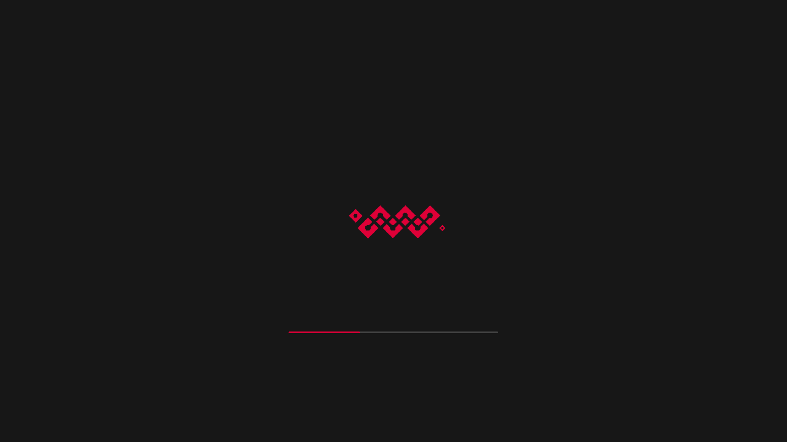
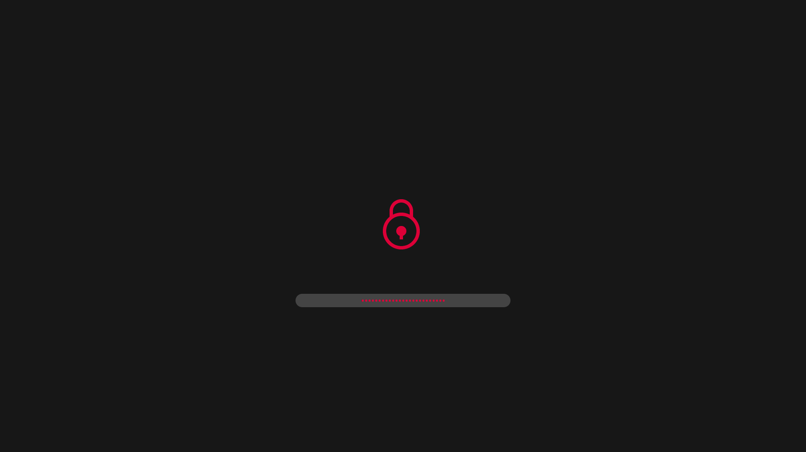

# **Chain Plymouth Theme**

<br>

## **Description**

This is a custom theme for [Plymouth](https://www.freedesktop.org/wiki/Software/Plymouth) inspired by the blockchain theme in [plymouth themes](https://github.com/adi1090x/plymouth-themes).


<br>

## **Preview**

| GIF | Loading | Password |
| --- | ------- | -------- |
||||

<br>

## **Installation**

You can use [this](https://wiki.archlinux.org/index.php/plymouth) entry in Archwiki to setup Plymouth and change themes.

<br>

## **Customization**

To help better adapt the plymouth theme to different computers, distros and rices, some elements are made customizable.

<br>

### **Positions and texts**

The file **chain.script** exposes a *Configuration* section in wich the position of individual elements can be customized, as well as the font in use and the different texts used.

Available customizations:
- the position of the animation
- the position of the progress bar
- the position of the lock icon
- the position of the password prompt
- the main font
- the placeholder text for the password prompt
- the character to use to obfuscate the password (bullet)

<br>

### **Colors**

The color palette of this theme consists of three following components:
- the main color for animation, progress bar, icons and password text,
- the secondary color for password input and progress bar background,
- the background color.

<br>

Currently, the color palette is <span style="color: #DA0037;">#DA0037 </span> for main, <span style="color: #444444;"> #444444 </span> for secondary and <span style="color: #171717;"> #171717 </span> for background.

<br>

For simplicity, the **change-color.sh** script is provided with the following usage:

```
Usage: ./change-color.sh <mode> <color>

The color must be a 6 digits hexadecimal code with a leading # (e.g "#ABC123")

Mode can be one of the following
 background       Set <color> as background color
 main             Set <color> as main theme color
 secondary        Set <color> as secondary color
```

**Be aware that [ImageMagick](https://imagemagick.org/) is needed to replace the colors of the animation and other graphical elements.**
