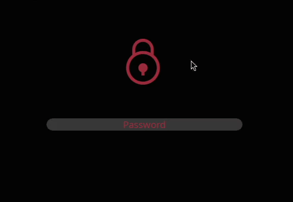

# **Plymouth Theme Chain**

## **Description**

This is a custom theme for [Plymouth](https://www.freedesktop.org/wiki/Software/Plymouth) inspired by the blockchain theme in [plymouth themes](https://github.com/adi1090x/plymouth-themes).


## **Preview**



## **Installation**

Simply place the content of this repo in */usr/share/plymouth/themes/chain* and use `plymouth-set-default-theme chain` to set the new theme. 
In some distributions like Ubuntu, changing the Plymouth theme must be done with `update-alternatives`.

Once the theme changed, you can use the following command to test it :

```bash
plymouthd; plymouth show-splash; sleep 3; plymouth ask-for-password; sleep 2; plymouth quit
```

If you are satisfied with the result, you can rebuild your initrd.

You can use [this](https://wiki.archlinux.org/index.php/plymouth) entry in Archwiki for more information about settting up Plymouth and changing themes.

### Arch-based distributions

You can install [plymouth-theme-chain][1] package from Arch User Repository:

```shell
git clone https://aur.archlinux.org/plymouth-theme-chain.git
cd plymouth-theme-chain
makepkg -si

# or using AUR helper
paru -S plymouth-theme-chain
```

Then select the theme usin `plymouth-set-default-theme`. 
The -R option ensures that it is rebuilt (otherwise manually run `mkinitcpio -P`):

```shell
# plymouth-set-default-theme -R chain
```

## **Customization**

To help better adapt the plymouth theme to different computers, distros and rices, some elements are made customizable.

### **Positions and texts**

The file **chain.script** exposes a *Configuration* section in wich the position of individual elements can be customized, as well as the font in use and the different texts.

Available customizations:
- the main font used for the boot message
- the secondary font used for the password prompt and the progress reports
- the position of the animation
- the position of the boot message
- the position of the progress bar
- the position of the progress messages
- the position of the lock icon
- the position of the password prompt
- the placeholder text for the password prompt
- the character used to obfuscate the password (bullet)

### **Colors**

The color palette of this theme consists of three following components:
- the main color for animation, progress bar, icons, boot message and password prompt
- the secondary color for password input background, progress bar background and the progress messages
- the background color.

For simplicity, the **change-color.sh** script is provided with the following usage:

```
Usage: ./change-color.sh <mode> <color>

The color must be a 6 digits hexadecimal code with a leading # (e.g "#ABC123")

Mode can be one of the following
 background       Set <color> as background color
 main             Set <color> as main theme color
 secondary        Set <color> as secondary color
```

**Be aware that [ImageMagick](https://imagemagick.org/) and [bc](https://www.gnu.org/software/bc/) are needed to replace the colors of the animation and other graphical elements.**

[1]: https://aur.archlinux.org/packages/plymouth-theme-chain
